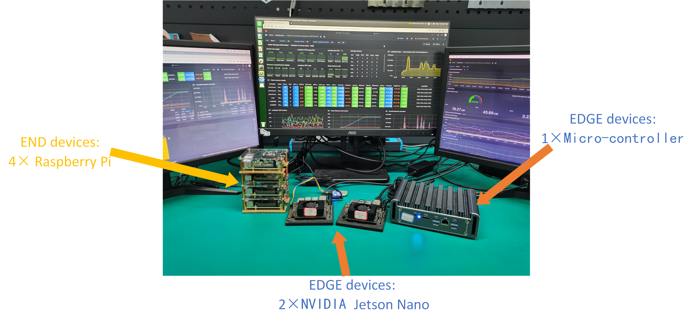
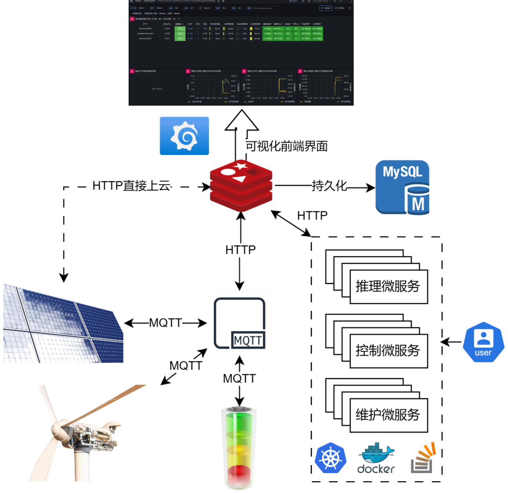
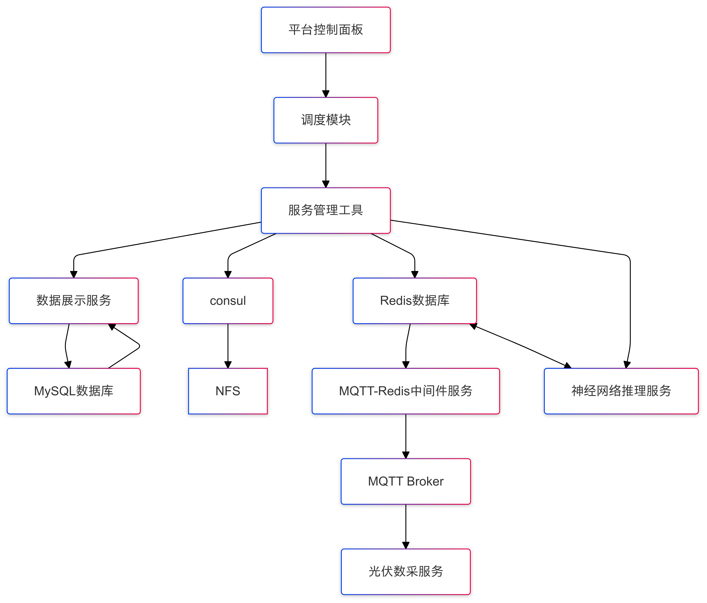

# Edge-Computing-Based-Flexible-Production-Line-Architecture-Design

This project is based on secondary development of k8s and deployment of components such as redis, mysql, consul, and Prometheus. The purpose is to deploy and orchestrate applications on the edge side, and to develop and deploy algorithms for industrial applications based on the MQTT protocol.

<!-- PROJECT SHIELDS -->

[![Contributors][contributors-shield]][contributors-url]
[![Forks][forks-shield]][forks-url]
[![Stargazers][stars-shield]][stars-url]
[![Issues][issues-shield]][issues-url]
[![MIT License][license-shield]][license-url]
[![LinkedIn][linkedin-shield]][linkedin-url]

<!-- PROJECT LOGO -->
<br />

<p align="center">
  <a href="https://github.com/kongfuguagua/ECPAD/blob/main/image.jpg">
    
  </a>

  <h3 align="center">ECPAD</h3>
  <p align="center">
    云(私有云)-边(Nano)-端(树莓派)架构
    <br />
    <a href="https://github.com/kongfuguagua/ECPAD"><strong>探索本项目的文档 »</strong></a>
    <br />
    <br />
    <a href="https://github.com/kongfuguagua/ECPAD">查看Demo</a>
    ·
    <a href="https://github.com/kongfuguagua/ECPAD/issues">报告Bug</a>
    ·
    <a href="https://github.com/kongfuguagua/ECPAD/issues">提出新特性</a>
  </p>

</p>


 本篇README.md面向开发者
 
## 目录

- [上手指南](#上手指南)
  - [开发前的配置要求](#开发前的配置要求)
  - [安装步骤](#安装步骤)
- [文件目录说明](#文件目录说明)
- [Demo](#Demo)
- [使用到的框架](#使用到的框架)
- [版本控制](#版本控制)
- [作者](#作者)
- [鸣谢](#鸣谢)

### 上手指南

本项目为自建实验平台，研究微服务编排算法，涉及到的应用包含真实场景和虚拟场景，而微服务化较为简单，socket为主要IPC手段，后续考虑使用API-RPC进行重构（视实验室和开源需求而定）。微服务镜像由于众所周知的原因不提供，可以根据需要自行build。具体步骤参考下面，祝大家科研顺利！！！
<p align="center">
  <a href="https://github.com/kongfuguagua/ECPAD/">
    
  </a>
  </p>
</p>


###### 开发前的配置要求

1. python3.10
2. golang1.22
3. 树莓派操作系统bullseye
4. Nano操作系统ubuntu18.04(nvidia官方只支持这个版本)
5. 群晖NAS(作为nfs和私有镜像仓库)

###### **安装步骤**

1. Clone the repo

```sh
git clone https://github.com/kongfuguagua/ECPAD.git
```

2. Build the images 

```sh
cd ApplicationLibrary/xxx
docker build -t --platform=linux/arm64 image_name:image_tag .
```

3. Deployment the application

```sh
cd Deployment
kubectl create xxx.yaml -n xxx
```

### 文件目录说明
eg:

ApplicationLibrary：各种应用(mnist检测、pv智能光伏、test文本处理、PLC-传感器和通信延时检测等)源代码

MicroserviceLibrary：微服务化的应用和Dockerfile

Deployment：应用的部署yaml文件

k8s Raspberry Pi/Nano：边缘侧K8s配置教程，主要针对ARM

k8s scheduler：二开调度器教程和demo


```
ECPAD 
├─ApplicationLibrary
│  ├─cross-compile-PLC
│  │  ├─project
│  │  ├─st_transition
│  │  └─utils
│  ├─mini_PLC
│  ├─mnist
│  │  ├─mnist-input
│  │  └─mnist-output
│  ├─mnist-TCP
│  │  ├─mnist-infer
│  │  ├─mnist-input
│  │  └─mnist-output
│  ├─mpu6050
│  ├─MQTT
│  │  ├─cpu_ram_occupation
│  │  ├─mnist-MQTT
│  │  ├─pv-MQTT
│  │  │  ├─mqtt-pv-infer
│  │  │  ├─mqtt-pv-input
│  │  │  └─mqtt-pv-output
│  │  ├─stresser-MQTT
│  │  └─text-MQTT
│  │      ├─mqtt-text-input
│  │      ├─mqtt-text-output
│  │      ├─mqtt-text-sort
│  │      └─mqtt-text-stats
│  ├─mqtt-mnist
│  │  ├─mqtt-cnn-mnist-infer
│  │  ├─mqtt-mnist-infer
│  │  ├─mqtt-mnist-input
│  │  └─mqtt-mnist-output
│  ├─pv
│  │  ├─mqtt-pv-infer
│  │  ├─mqtt-pv-input
│  │  └─mqtt-pv-output
│  ├─resource underutilization
│  ├─sensors
│  │  ├─8266myql_demo
│  │  ├─http_demo
│  │  ├─myql_demo
│  │  ├─shine_demo
│  │  └─time_demo
│  └─text
│      ├─mqtt-text-input
│      ├─mqtt-text-output
│      ├─mqtt-text-sort
│      └─mqtt-text-stats
├─deep learning
├─Deployment
│  ├─consul
│  └─nfs
├─Help
│  ├─docker start
│  │  ├─docker swarm
│  │  ├─mnist-infer
│  │  ├─mnist-input
│  │  └─mnist-output
│  ├─image debug
│  ├─k8s调试文件
│  └─MQTT开发
│      ├─mqtt
│      ├─mqtt-mnist-image
│      │  ├─mqtt-cnn-mnist-infer
│      │  ├─mqtt-mnist-infer
│      │  ├─mqtt-mnist-input
│      │  └─mqtt-mnist-output
│      └─src_mqtt
├─k8s nvidia nano
├─k8s Raspberry Pi
├─k8s scheduler
│  ├─nodename_demo
│  ├─promethues-filter-score-demo
│  └─promethues_score_demo
├─MicroserviceLibrary
│  ├─Example
│  │  ├─base_example
│  │  ├─pv_example_3_ms
│  │  └─string_example_3_ms
│  ├─grafana
│  ├─mnist
│  │  ├─mnist-infer
│  │  ├─mnist-input
│  │  └─mnist-output
│  ├─mqtt2redis
│  ├─pv
│  │  ├─mqtt-pv-infer
│  │  ├─mqtt-pv-input
│  │  └─mqtt-pv-output
│  ├─pv_datasource
│  ├─pv_infer
│  ├─text
│  │  ├─mqtt-text-input
│  │  ├─mqtt-text-output
│  │  ├─mqtt-text-sort
│  │  └─mqtt-text-stats
│  └─资源浪费程序
├─Monitoring
├─Registration
│  └─consultest
│      ├─requestservice
│      └─testservice
└─Storage
```


### Demo 

一个光伏领域的预测性维护应用框图如下：

<p align="center">
  <a href="https://github.com/kongfuguagua/ECPAD/blob/main/energy.png">
    
  </a>
  <a href="https://github.com/kongfuguagua/ECPAD/blob/main/diagram.png">
    
  </a>
  </p>
</p>

涉及模块均可以在MicroserviceLibrary找到，主要包括Redis、Consul、PV*、MQTT、Sensors


### 使用到的框架

- [OpenPLC](https://openplcproject.gitlab.io/)
- [Domain-driven design](https://en.wikipedia.org/wiki/Domain-driven_design)


#### 如何参与开源项目

贡献使开源社区成为一个学习、激励和创造的绝佳场所。你所作的任何贡献都是**非常感谢**的。


1. Fork the Project
2. Create your Feature Branch (`git checkout -b feature/AmazingFeature`)
3. Commit your Changes (`git commit -m 'Add some AmazingFeature'`)
4. Push to the Branch (`git push origin feature/AmazingFeature`)
5. Open a Pull Request


### 作者

a25505597703@gmail.com  


### 版权说明

该项目签署了MIT 授权许可，详情请参阅 [LICENSE.txt](https://github.com/kongfuguagua/ECPAD/blob/master/LICENSE.txt)

### 鸣谢


- [GitHub Emoji Cheat Sheet](https://www.webpagefx.com/tools/emoji-cheat-sheet)
- [Img Shields](https://shields.io)
- [Choose an Open Source License](https://choosealicense.com)
- [GitHub Pages](https://pages.github.com)
- [Animate.css](https://daneden.github.io/animate.css)

<!-- links -->
[your-project-path]:kongfuguagua/ECPAD
[contributors-shield]: https://img.shields.io/github/contributors/kongfuguagua/ECPAD?style=flat-square
[contributors-url]: https://github.com/kongfuguagua/ECPAD/graphs/contributors
[forks-shield]: https://img.shields.io/github/forks/kongfuguagua/ECPAD?style=flat-square
[forks-url]: https://github.com/kongfuguagua/ECPAD/network/members
[stars-shield]: https://img.shields.io/github/stars/kongfuguagua/ECPAD?style=flat-square
[stars-url]: https://github.com/kongfuguagua/ECPAD/stargazers
[issues-shield]: https://img.shields.io/github/issues/kongfuguagua/ECPAD?style=flat-square
[issues-url]: https://img.shields.io/github/issues/kongfuguagua/ECPAD
[license-shield]: https://img.shields.io/github/license/kongfuguagua/ECPAD?style=flat-square
[license-url]: https://github.com/kongfuguagua/ECPAD/blob/master/LICENSE.txt
[linkedin-shield]: https://img.shields.io/badge/-LinkedIn-black.svg?style=flat-square&logo=linkedin&colorB=555
[linkedin-url]: https://linkedin.com/in/kongfuguagua


